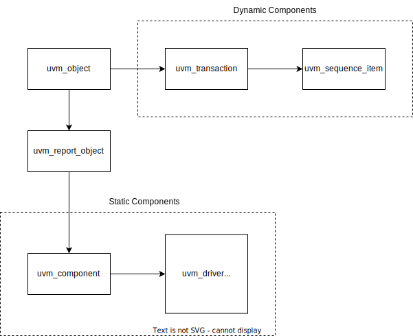

# UVM Basics

## UVM Resources

```sv
`include "uvm_macros.svh"
import uvm_pkg::*;
```

## UVM Inheritance Structure




## Reference Manual

The UVM 1.2 Reference Manual can be found at [this link](https://verificationacademy.com/verification-methodology-reference/uvm/docs_1.2/html/index.html).
