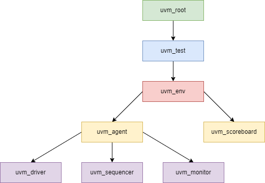

# UVM Test

The `uvm_test` base class is used to create tests in the UVM. It is extended from the `uvm_component` base class.

## Extending uvm_test

A simple example of extending the `uvm_test` base class to create a custom class is as follows:

```sv
`include "uvm_macros.svh"
import uvm_pkg::*;

class test extends uvm_test;
  `uvm_component_utils ( test )

  // The constructor takes 2 arguments since it is extended from uvm_component
  function new( string inst = "test", uvm_component parent = null );
    super.new( inst, parent );
  endfunction : new

  virtual function void build_phase( uvm_phase phase );
    super.build_phase( phase );
    `uvm_info( "test", "Build phase executed", UVM_NONE )
  endfunction : build_phase

  virtual task run_phase( uvm_phase phase );
    `uvm_info( "test", "Run phase executed", UVM_NONE )
  endtask : run_phase 

endclass : test

module tb;

  initial begin
    run_test( "test" );
  end

endmodule : tb
```

Note that the `super` keyword is not needed when overriding task-based phases, but only with function-based phases.

## Objections

If objections are not used, the simulator will cycle through each phase in 0ns, even if a temporal delay (such as `#20`) is added to the `run_phase` task.

As a result, in order to run simulations for more than 0 ns, it is necessary to _raise and drop objections_, as seen below:

```sv
`include "uvm_macros.svh"
import uvm_pkg::*;

class test extends uvm_test;
  `uvm_component_utils( test )

  function new( string inst = "test", uvm_component parent = null );
    super.new( inst, parent );
  endfunction : new

  virtual task run_phase( uvm_phase phase );
    phase.raise_objection( this );
    #20
    `uvm_info( "test", "Executed the run phase", UVM_NONE )
    phase.drop_objection( this );
  endtask : run_phase

endclass : test

module tb;

  initial begin
    run_test( "test" );
  end

endmodule : tb
```

## UVM Tree

The hierachical organization of a UVM testbench can be seen in the following figure:



### Printing the UVM Hierarchy

The organization of the UVM hierarchy can be visualized by using the `print_topology()` method that belongs to `uvm_top`. Note that `uvm_top` is a global variable that can be accessed from anywhere in the testbench.

```sv
virtual function void end_of_elaboration_phase( uvm_phase phase );
  super.end_of_elaboration_phase( phase );
  uvm_top.print_topology();
endfunction : end_of_elaboration_phase
```
